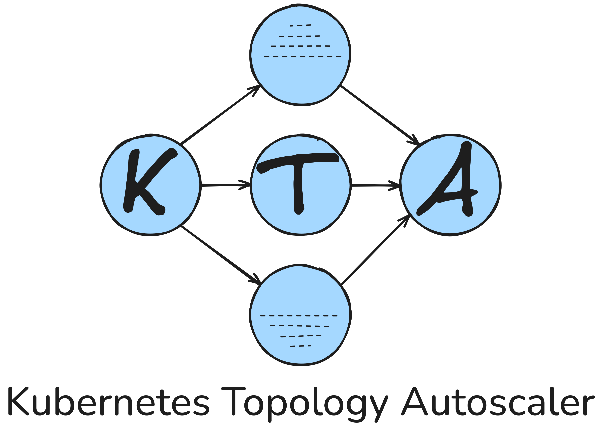

<!-- Allow logo to be the first element -->
<!-- markdownlint-disable MD041 -->
<!-- markdownlint-disable MD033 -->

  <picture>
    <source media="(prefers-color-scheme: light)" width="512" srcset="assets/logo-light_mode.png">
    <source media="(prefers-color-scheme: dark)" width="512" srcset="assets/logo-dark_mode.png">
    <!-- Fall back to version that works for dark and light mode -->
    
  </picture>

<a href="https://dynatrace-oss.github.io/kubernetes-topology-autoscaler/">Website</a> | <a href="https://dynatrace-oss.github.io/kubernetes-topology-autoscaler/quick-start/">Quick Start</a> | <a href="https://dynatrace-oss.github.io/kubernetes-topology-autoscaler/user-guide/">User Guide</a>

 
<!-- markdownlint-enable MD033 -->

This is a monorepo that contains the Kubernetes Topology Autoscaler (KTA)

- Kubernetes Operator,
- Python SDK,
- quick start examples, and
- website.

## 🤔 What is Kubernetes Topology Autoscaler (KTA)?

**TL;DR** Kubernetes Topology Autoscaler (KTA) is a framework composed of a Kubernetes Operator and a Python SDK, specifically designed for research, development and deployment of custom autoscaling algorithms for stream processing applications running on Kubernetes.

## 💡 The Motivation Behind KTA

> For a detailed comparison with other Kubernetes autoscaling solutions, pleaser refer to [Comparison to Related Projects](https://dynatrace-oss.github.io/kubernetes-topology-autoscaler/user-guide/related-projects/).

Stream processing applications are structured as directed acyclic graphs (also referred to as "streaming topology"), where nodes represent operators (e.g., filter, join, aggregation) and edges represent data flow. While this architecture enables scalable execution of data-intensive real-time workflows, it also introduces complex interdependencies between operators, making horizontal autoscaling challenging. To address these challenges, state-of-the-art horizontal autoscaling algorithms for stream processing applications[^1] -- such as [DS2](https://www.usenix.org/system/files/osdi18-kalavri.pdf) -- **go beyond simple, threshold-based rules** and judiciously determine the **parallelism at the operator-level** of the streaming topology.

While there are several existing horizontal autoscaling solutions for Kubernetes, they

- are limited in expressiveness, mostly relying on static scaling rules ([HPA](https://kubernetes.io/docs/tasks/run-application/horizontal-pod-autoscale/), [KEDA](https://keda.sh/))
- are tightly coupled to a specific framework (e.g., [Flink Kubernetes Operator Autoscaler](https://nightlies.apache.org/flink/flink-kubernetes-operator-docs-main/docs/custom-resource/autoscaler/)), or
- only support scaling a single resource (e.g., a single Deployment) in isolation ([HPA](https://kubernetes.io/docs/tasks/run-application/horizontal-pod-autoscale/), [KEDA](https://keda.sh/), [Custom Pod Autoscaler](https://custom-pod-autoscaler.readthedocs.io/en/latest/)).

**KTA addresses these limitations** by providing a generic framework for research, development and deployment of stream processing autoscaling algorithms. KTA enables fine-grained, horizontal scaling at the operator level[^2], and allows users to define custom stream processing autoscaling algorithms using a general purpose programming language. Implement your autoscaling algorithm with the [KTA Python SDK](https://github.com/dynatrace-oss/kubernetes-topology-autoscaler/kta-python-sdk), and the [KTA Kubernetes Operator](https://github.com/dynatrace-oss/kubernetes-topology-autoscaler/kta-kubernetes-operator) handles orchestration and reconciliation.

At [Dynatrace Research](https://www.dynatrace.com/research/), we actively use KTA for research and development of stream processing autoscaling algorithms 🔬🧪

## ⭐ Key Features

> For upcoming features, please refer to our [Roadmap](https://dynatrace-oss.github.io/kubernetes-topology-autoscaler/community/roadmap/).

- **Framework-/System-agnostic scaling**: Supports operator-level scaling over streaming topologies. Deployment-level scaling is also supported, as it is just a special case of operator-level scaling (i.e., a topology with a single node).
- **Research and prototyping**: Focus on algorithm development, not on writing boiler plate code or worrying about orchestration.
- **Support for complex algorithms**: Algorithms can be implemented in Python using the [KTA Python SDK](https://github.com/dynatrace-oss/kubernetes-topology-autoscaler/kta-python-sdk)[^3]. This includes algorithms that are based on machine learning.
- **Composable architecture**: Built on the **M**onitor-**A**nalyze-**P**lan-**E**xecute over shared **K**nowledge (**MAPE-K**) feedback loop. Implement your autoscaling algorithm once and reuse it across different monitoring systems and stream processing frameworks by only customizing the Monitor step.
- **Traceable decision-making**: The result of each loop iteration ("Knowledge") is stored in the Kubernetes Operator, ensuring transparency and traceability of scaling decisions.

## 🗺️ System Overview

## 📜 License

This project is licensed under [Apache License 2.0](https://github.com/dynatrace-oss/kubernetes-topology-autoscaler/LICENSE).

## 💻 Contributing

See [Contributor Guide](https://dynatrace-oss.github.com/kubernetes-topology-autoscaler/community/contributor-guide/).

## ⚖️ Disclaimer

Created by [Dynatrace Research](https://www.dynatrace.com/research/).

For general questions or inquiries, please open a [GitHub issue](https://github.com/dynatrace-oss/kubernetes-topology-autoscaler/issues/new?template=04-general_question.md).

<!-- markdownlint-disable MD028 -->
> [!CAUTION]
> KTA is currently in alpha.
>
> We recommend using KTA in a test environment.
> The API and behavior may change without prior notice.
> Use at your own risk.

> ℹ️ **Note**  
> This product is _not_ officially supported by Dynatrace.
<!-- markdownlint-enable MD028 -->

[^1]: Ranging from frameworks like [Apache Flink](https://flink.apache.org/) and [Apache Kafka Streams](https://kafka.apache.org/documentation/streams/) to native-Kubernetes streaming workflows that are organized as a directed acyclic graph of Kubernetes Resources that implement the Scale Subresource.
[^2]: If and how operator-level scaling can be supported depends on the respective system. Currently, we support operator-level scaling for Apache Kafka Streams, Apache Flink, and native-Kubernetes streaming worfklows that are composed of Kubernetes Deployments.
[^3]: Actually any programming language, as long as there is a way to handle HTTP requests. However, currently you would have to handle the low-level interactions with the KTA Kubernetes Operator for other programming languages than Python yourself.
