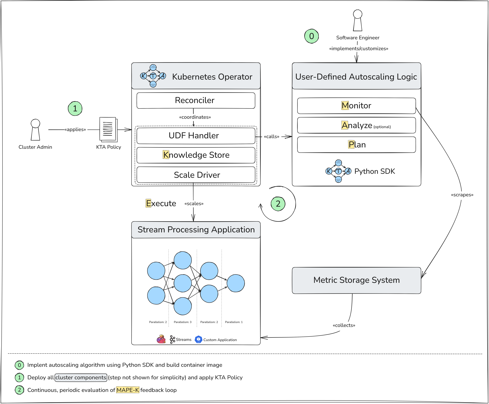

<!--
   Copyright (c) 2024 Dynatrace LLC
  
   Licensed under the Apache License, Version 2.0 (the "License");
   you may not use this file except in compliance with the License.
   You may obtain a copy of the License at
   
       http://www.apache.org/licenses/LICENSE-2.0
  
   Unless required by applicable law or agreed to in writing, software
   distributed under the License is distributed on an "AS IS" BASIS,
   WITHOUT WARRANTIES OR CONDITIONS OF ANY KIND, either express or implied.
   See the License for the specific language governing permissions and
   limitations under the License.
  -->

# Kubernetes Topology Autoscaler (KTA)

## 🤔 What is Kubernetes Topology Autoscaler (KTA)?

Kubernetes Topology Autoscaler (KTA) is a framework composed of a Kubernetes Operator and a Python SDK, specifically designed for **research, development and deployment of custom autoscaling algorithms for stream processing applications[^1] running on Kubernetes**.

The autoscaling process follows the **M**onitor-**A**nalyze-**P**lan-**E**xecute over shared **K**nowledge (**MAPE-K**) feedback loop. This process is supported by 2 key components.

- **KTA Python SDK**  
The KTA Python SDK defines interfaces for the Monitor, Analyze (optional), and Plan steps. For modularity, encapsulation, and reusability, each step is implemented as a separate Python function (user-defined autoscaling logic). These functions together form the autoscaling algorithm. The SDK also includes built-in functionality for deploying algorithms.
- **KTA Kubernetes Operator**  
The KTA Kubernetes Operator orchestrates the autoscaling and reconciliation process. It operates based on a so-called **KTA Policy**, which specifies the autoscaling algorithm to use and the target application to scale. The KTA Kubernetes Operator is also responsible for the Execute step using a so-called **KTA Scale Driver**. KTA Scale Drivers abstract the scaling logic and make KTA agnostic to the underlying stream processing framework.

## ⭐ Key Features

> For upcoming features, please refer to our [Roadmap](community/roadmap/).

- **Framework-/System-agnostic scaling**: Supports operator-level scaling over streaming topologies[^2]. Deployment-level scaling is also supported, as it is just a special case of operator-level scaling (i.e., a topology with a single node).
- **Research and prototyping**: Focus on algorithm development, not on writing boiler plate code or worrying about orchestration.
- **Support for complex algorithms**: Algorithms can be implemented in Python using the [KTA Python SDK](https://github.com/dynatrace-oss/kubernetes-topology-autoscaler/kta-python-sdk)[^3]. This includes algorithms that are based on machine learning.
- **Composable architecture**: Built on the MAPE-K feedback loop. Implement your autoscaling algorithm once and reuse it across different monitoring systems and stream processing frameworks by only customizing the Monitor step.
- **Traceable decision-making**: The result of each loop iteration ("Knowledge") is stored in the Kubernetes Operator, ensuring transparency and traceability of scaling decisions.

## ↔️ KTA vs. other Kubernetes Autoscaling Solutions

Stream processing applications are structured as directed acyclic graphs (also referred to as "streaming topology"), where nodes represent operators (e.g., filter, join, aggregation) and edges represent data flow. While this architecture enables scalable execution of data-intensive real-time workflows, it also introduces complex interdependencies between operators, making horizontal autoscaling challenging.
State-of-the-art horizontal autoscaling algorithms for stream processing applications -- such as {{ external_link("DS2", "https://www.usenix.org/system/files/osdi18-kalavri.pdf") }} -- **go beyond simple, threshold-based rules** and judiciously determine the **parallelism at the operator-level** of the streaming topology.

While there are several existing horizontal autoscaling solutions for Kubernetes, they

- are limited in expressiveness, mostly relying on static scaling rules ({{ external_link("HPA", "https://kubernetes.io/docs/tasks/run-application/horizontal-pod-autoscale/") }}, {{ external_link("KEDA", "https://keda.sh/") }})
- are tightly coupled to a specific framework (e.g., {{ external_link("Flink Kubernetes Operator Autoscaler", "https://nightlies.apache.org/flink/flink-kubernetes-operator-docs-main/docs/custom-resource/autoscaler/") }}), or
- only support scaling a single resource (e.g., a single Deployment) in isolation ({{ external_link("HPA", "https://kubernetes.io/docs/tasks/run-application/horizontal-pod-autoscale/") }}, {{ external_link("KEDA", "https://keda.sh/") }}, {{ external_link("Custom Pod Autoscaler", "https://custom-pod-autoscaler.readthedocs.io/en/latest/") }}).

Unlike other Kubernetes autoscaling solutions, **KTA is specifically tailored for stream processing applications**.
It allows users to implement and deploy operator-level (and also deployment-level) autoscaling algorithms over streaming topologies in a general-purpose programming language, while remaining agnostic to the underlying stream processing framework.

??? question "Should I always prefer KTA over other autoscaling solutions?"
    Although KTA can be considered a superset of other autoscaling solutions like {{external_link("Horizontal Pod Autoscaler (HPA)", "https://kubernetes.io/docs/tasks/run-application/horizontal-pod-autoscale/") }}, offering the ability to implement similar scaling policies, it trades ease of configuration and operational simplicity for greater flexibility and extensibility.
    KTA is specifically designed to meet the demands of stream processing applications, where resources are highly interdependent and scaling one resource often necessisates coordinated scaling of others.
    Therefore, we recommend carefully evaluating your application's requirements to determine whether KTA is a suitable fit.
    For workloads where a simple, rule-based scaling policy effectively captures usage patterns, purely declarative solutions like HPA may offer a more lightweight and maintainable alternative.

## 🗺️ System Overview

The image below shows the conceptual system overview of KTA.

## 🚧 Current Limitations

- Both -- the KTA components and the stream processing application -- must run in the `default` namespace. While alternative configurations may be possible, they have not been tested.
- Scaling of native Kubernetes stream processing applications where each node in the streaming topology is a separate Kubernetes resource is currently only supported for `Deployments`.
- Interactions between the KTA Kubernetes Operator and user-defined autoscaling logic (implemented using the Python SDK) are synchronous. If the autoscaling algorithm is computationally intensive (e.g., an online machine learning algorithm), this can lead to prolonged, blocking reconciliation processes.
- Changes to the stream processing application by other entities than KTA (e.g., manual scaling) are not actively monitored and do not trigger a reconciliation.
- Results from MAPE-K loop iterations are stored only in memory in the Kubernetes Operator and are not persisted.

[^1]: Ranging from frameworks like [Apache Flink](https://flink.apache.org/) and [Apache Kafka Streams](https://kafka.apache.org/documentation/streams/) to native-Kubernetes streaming workflows that are organized as a directed acyclic graph of Kubernetes Resources that implement the Scale Subresource.
[^2]: If and how operator-level scaling can be supported depends on the respective system. Currently, we support operator-level scaling for Apache Kafka Streams, Apache Flink, and native-Kubernetes streaming worfklows that are composed of Kubernetes Deployments.
[^3]: Actually any programming language, as long as there is a way to handle HTTP requests. However, currently you would have to handle the low-level interactions with the KTA Kubernetes Operator for other programming languages than Python yourself.
